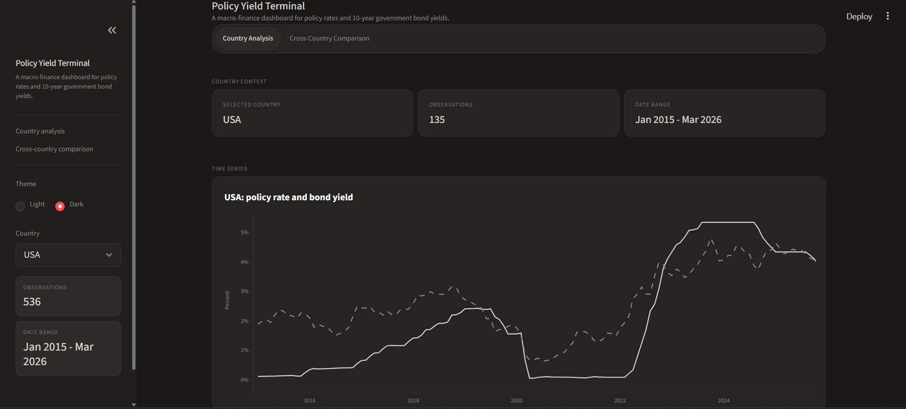
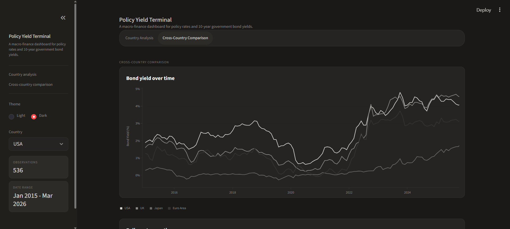

# Policy Yield Terminal: Central Bank Rates and 10-Year Bond Yields

## Overview

Policy Yield Terminal is a Streamlit dashboard that analyzes the relationship between central bank policy rates and 10-year government bond yields across the USA, UK, Japan, and the Euro Area.

This project connects finance, economics, and data analysis by showing how changes in short-term policy rates may relate to long-term government bond yields.

## Objective

The goal of this project was to explore the relationship between central bank policy rates and 10-year government bond yields across different economies.

The main questions were:

- How do policy rates and bond yields move over time?
- Which countries show the strongest relationship between policy rates and 10-year bond yields?
- Can a simple regression model be used to estimate bond yields based on policy rates?

## Tools Used

- Python
- Streamlit
- pandas
- Plotly
- statsmodels
- openpyxl
- Excel

## Dashboard Preview

### Country Analysis



### Cross-Country Comparison


## Features

- Interactive country selection
- Policy rate and bond yield time-series charts
- Scatterplot showing the relationship between policy rates and bond yields
- OLS regression output with R-squared, coefficient, and p-value
- Simple bond yield prediction tool
- Cross-country comparison for the USA, UK, Japan, and Euro Area
- Light and dark theme options

## Data

The project uses panel data containing:

- Date
- Country
- Policy Rate
- 10-Year Government Bond Yield

The dashboard uses data from FRED, the Federal Reserve Bank of St. Louis.

## Methods

This project uses:

- Data cleaning
- Summary statistics
- Time-series visualization
- Scatterplot analysis
- Ordinary Least Squares regression
- Cross-country comparison
- Simple prediction based on fitted regression results

## Key Findings

- The relationship between policy rates and 10-year government bond yields varies by country.
- The UK showed the strongest relationship between policy rates and bond yields.
- The Euro Area also showed a relationship, but slightly weaker than the UK.
- The USA showed a strong relationship, but 10-year yields are also influenced by broader factors such as inflation expectations, investor demand, recession concerns, and global market conditions.
- Japan showed little to no relationship because its policy rate environment had very little variation during the period studied.

## How to Run the Project

1. Clone this repository or download the files.
2. Install the required packages:

```bash
python -m pip install -r requirements.txt
```

3. Run the Streamlit app:

```bash
python -m streamlit run app.py
```

## Project Files

- `app.py` - Main Streamlit dashboard application
- `Global_Monetary_Panel_Data.xlsx` - Dataset used in the dashboard
- `requirements.txt` - Python packages required to run the app
- `README.md` - Project documentation

## What I Learned

Through this project, I practiced:

- Building an interactive dashboard with Streamlit
- Cleaning and organizing financial/economic data
- Creating time-series and scatterplot visualizations
- Running and interpreting regression models
- Explaining financial relationships in a clear and simple way
- Connecting Python coding skills to real-world finance and economics questions
